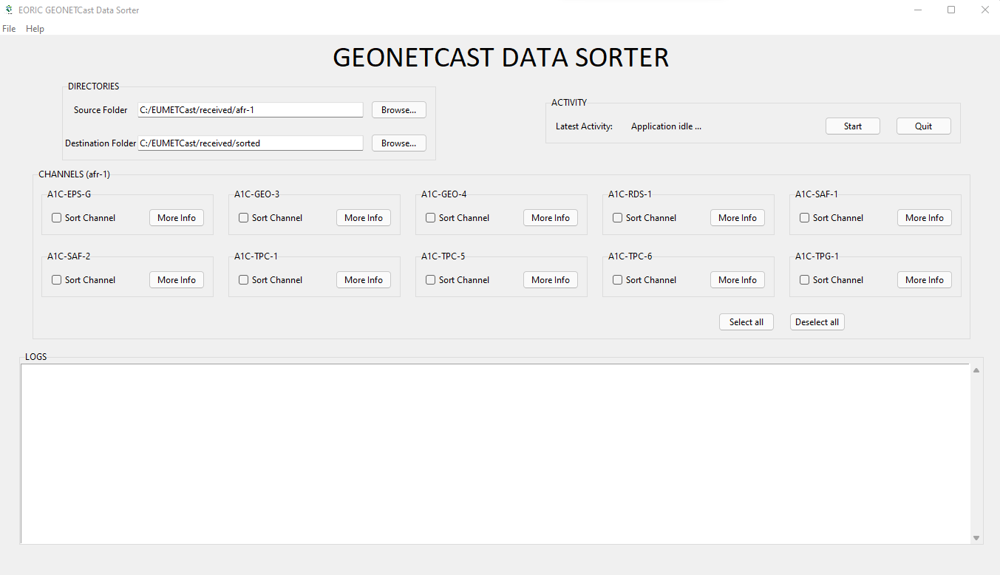

# EUMETCast Data Sorter EORIC
 Simple tkinter application to sort data products of various channels received from EUMETCast 

# How to run this application
(The following instructions apply to Windows command line.)

To run this app first clone repository and then open a terminal to the app folder.

```
git clone https://github.com/nkwasey/EUMETCast-Data-Sorter-EORIC.git
```

Run the app:
```
python app.py
```
# Run by exe application
Open "exe file" folder
Click on the app.exe file to start application

# Screenshot


# Resources
### Data Products Catalogue:
- [Download file](https://eoric.uenr.edu.gh/wp-content/uploads/2022/03/GEONETCAST-Data-Products-2022.pdf)

